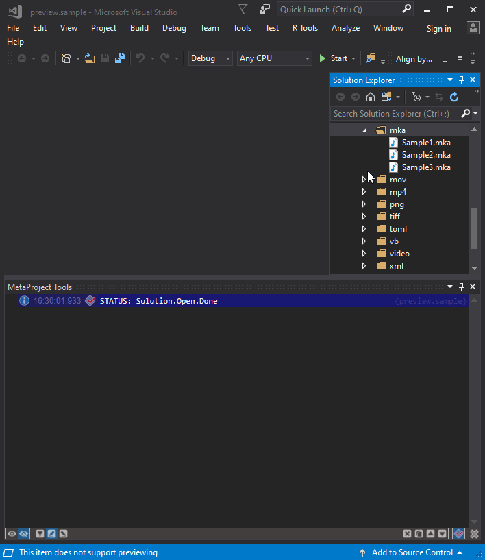

---

### This extension is working only with installed [MetaOutput](https://www.metaoutput.net/) extension!

---

### Now you can look inside [3GP](https://en.wikipedia.org/wiki/3GP_and_3G2), [3G2](https://en.wikipedia.org/wiki/3GP_and_3G2), [AFS](https://en.wikipedia.org/wiki/Advanced_Systems_Format), [AVI](https://en.wikipedia.org/wiki/Audio_Video_Interleave), [F4V](https://en.wikipedia.org/wiki/Flash_Video), [M4V](https://en.wikipedia.org/wiki/M4V), [MKV](https://en.wikipedia.org/wiki/Matroska), [MOV](https://en.wikipedia.org/wiki/QuickTime_File_Format), [MP4](https://en.wikipedia.org/wiki/MPEG-4), [MPEG](https://en.wikipedia.org/wiki/MPEG-1), [MPG](https://en.wikipedia.org/wiki/MPEG-1), [MP1](https://en.wikipedia.org/wiki/MPEG-1), [MP2](https://en.wikipedia.org/wiki/MPEG-2), [OGV](https://ru.wikipedia.org/wiki/Ogg) and [WMV](https://en.wikipedia.org/wiki/Windows_Media_Video) file not opening it.

---

---

Data visualization is based on [MetaOutput](https://www.metaoutput.net/)

Data extraction is based on [TagLib-Sharp](https://github.com/mono/taglib-sharp) and [MetadataExtractor](https://github.com/drewnoakes/metadata-extractor-dotnet)
